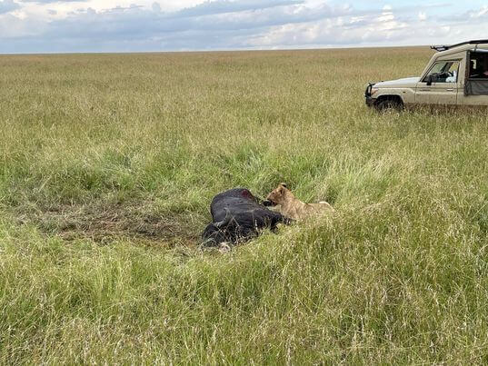

another city called Mombasa.

I also went to an elephant orphanage.

○○公園  
（場所の説明）  

rip-off  
ぼったくり  
________________________________________________
## kaki
前回は研修の話とかケニアの都市の話とか聞かせてくれてありがとう。  

ところで、アフリカと言えば動物と大自然のイメージがあるけど、そういう場所には行ってみた？  

Thank you for telling me about medical placement and Kenya's city.  

By the way, speaking of Africa, did you go to safaris and see wild animals?  

## Katie
Yes! I did!  
I went to Masai Mara and Hell's Gate National Park.  

Hell's Gate National Park has a rock that became a model for "Pride Rock" in "The Lion King".  

## kaki
That's Cool!  
I searched [Masai Mara National Park](https://www.masaimara.travel/) and [HELLS GATE NATIONAL PARK](http://www.kws.go.ke/content/hells-gate-national-park).  

They look exciting!  

Did you take any photos?  

## Katie
Yes!  
I took so many.  

I can show you some good ones.  

  

  

  

  

  

## kaki
Wooooow!!! Amazing!!!  

I've never seen wild giraffe, zebra and elephant.  

I have only seen them in a zoo.  

野生のキリンとかシマウマとか像とか、初めて見たよ！  
動物園（の中の檻）ぐらいでしか見た事ない！  

## Katie
It's awesome to see wild animals in their natural habitat - running around, eating and just living their lives!  

## kaki
ライオンも居るけど、危なくないの？　これ。  
襲ってきたら超怖いけど。  

I found lions!  
Aren't they dangerous?  

If they attack you, it is very scary.  

## Katie
Apparently, the lions are scared of cars because they are bigger than them.  

So, as long as you stay inside the car you'll be safe.  

But it can be a little scary when the lions come very near as the cars don't have windows.  

## kaki
Really?  

It is very scary!  
Claws and fangs could reach inside the car if you were unlucky!  

## Katie
Yeah, possibly.  

But, normally they don't attack you. So, don't worry.  

## kaki
I see.  

When I go to safaris, I won't worry about it.  

## Katie
I also went to an elephant orphanage to see some baby elephants.  

## kaki
それは、この写真？  
確かに像にしては小さいね。まだ子どもなんだ。  

温厚な性格とは聞くけど、触れたりする？  

Is that this photo?  

I thought the elephant looked smaller than what I expected.  

I heard they are friendly, can you touch them?  

キリンやシマウマも触れるか気になるけど。  
I wonder if you can touch giraffes and zebras too.  

## Katie
You can touch the elephants in the orphanage if they come near you. Sometimes they're really playful and touch your face with their trunks too!  
You just have to be careful not to let them step on your feet when they get too close!  

## kaki
That's very exciting!  

I want to touch them too.

How did the elephant's skin feel like?

## Katie
They are covered in dry mud so it feels hard and rough.

## kaki
そうなんだ！めっちゃ興味湧くね。

動物園で見る事はできるけど、触る事はできないからね。

それにしても、広大な自然が凄いね。  

風景の写真とかも見てみたい。

I see, interesting!

We can see them in the zoo, but we can't touch them.

By the way, the nature seems so vast!

Do you have any other photos of the landscape?

## Katie
あるよ。こんな感じ。  
Yes, sure!  
These are some of my favorite photos.  

  

  

  

  

## kaki
すげええー－－！！！  
何かもう言葉が出てこない！  

素材サイトのフリー素材みたい！  

特に最後の夕日なんて凄すぎる！  
めちゃめちゃ神秘的！  

Amaaaaaaazing!  
I don't have a word!  

It seems like free material from photo websites.

Especially, the last photo of the sunset is awe-inspiring!

## Katie
Yeah! It was beautiful!

But, actually the last photo is of the sunrise, not sunset.

## kaki
Really?

I didn't notice that. HAHAHA.

Then, did you go to the safari really early?

## Katie
Yeah, animals are most active during the night and early morning.  
So, we went there before sunrise to try and see as many animals as we can.

We were hoping to see the lions hunt but we only found them after they fed already.

## kaki
そうなんだ。じゃ運が良かったから狩りをする瞬間とか見れるの？

Great!  
We can see them hunting if we are lucky?  

## Katie
Yes! definitely!  
I couldn't see them hunting, but I saw a pride of lioness and their kids eating fresh buffalo!

## kaki
すげー！　そんな生々しい光景とかも見れるんだ！

大自然の厳しさを感じる光景
大自然の弱肉強食の厳しさを感じる事が出来る風景

Wow! You really witnessed the circle of life!

  

## Katie
あと、サバンナ以外だと、こんな感じの風景もあるよ。  

  

  

## kaki
ええええ！？　何これ？！　どこ？？  

めちゃくちゃ奇麗なビーチじゃん！

ケニア・・・というかアフリカって、全然ビーチのイメージとか無かったからびっくりしたよ！

ってか、海あったんだ。

## Katie

________________________________________

orphanage  
孤児院  

friendly  
温厚な性格（友好的）  

trunks  
象の鼻（nose とは言わない）  

I don't have a word!  
言葉が出てこない  
（悪い意味でも使える）  

awe-inspiring  
神秘的  

pride  
ライオンの群れ  

lioness  
雌のライオン  

生々しい光景  
→ 大自然の厳しさを感じる光景  
→ 大自然の弱肉強食の厳しさを感じる事が出来る風景  

Wow! You really witnessed the circle of life!  

