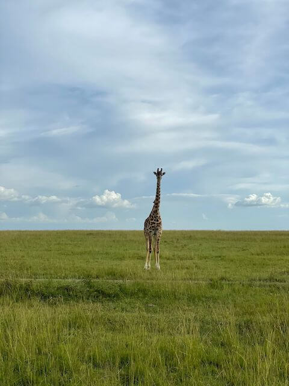
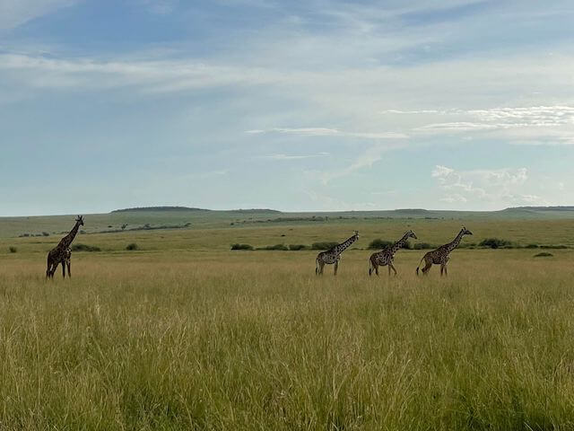
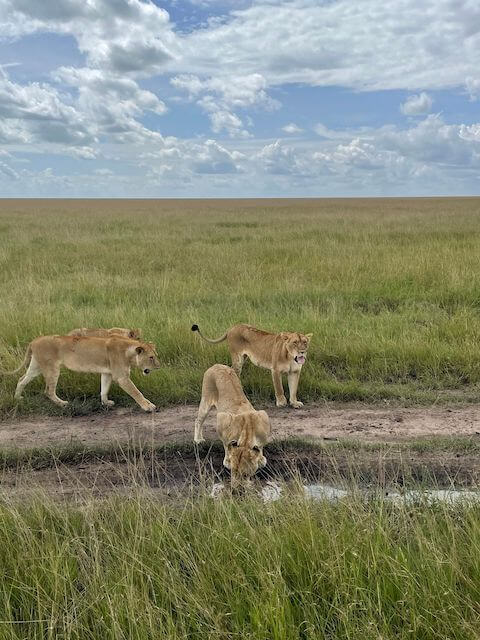
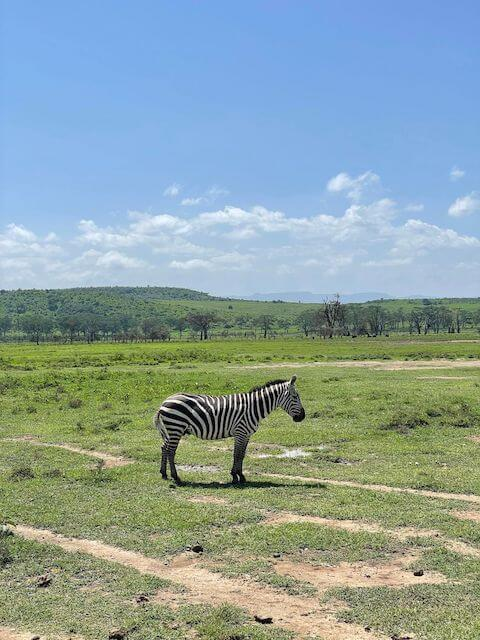
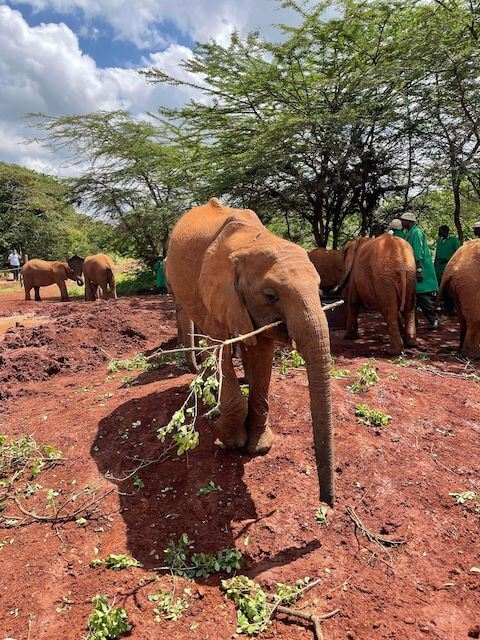
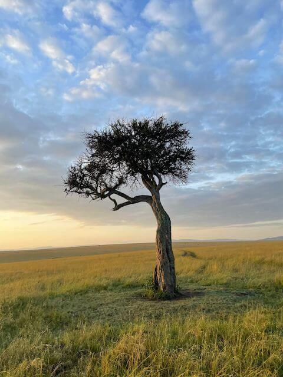
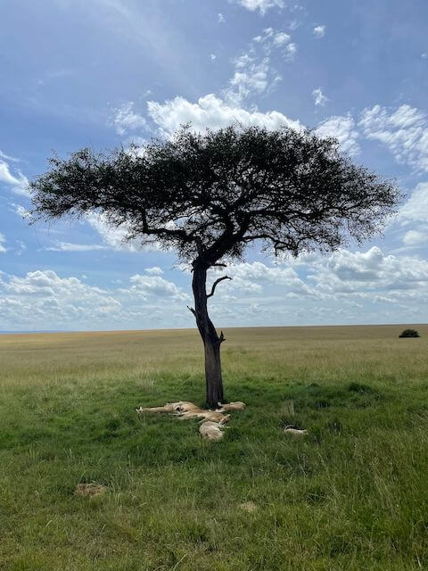
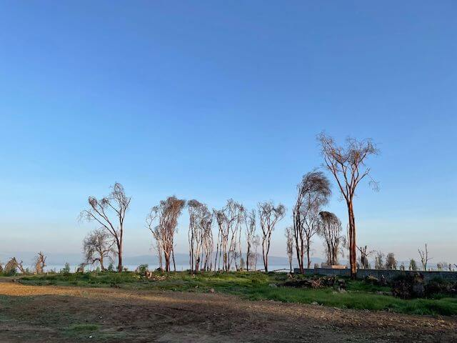
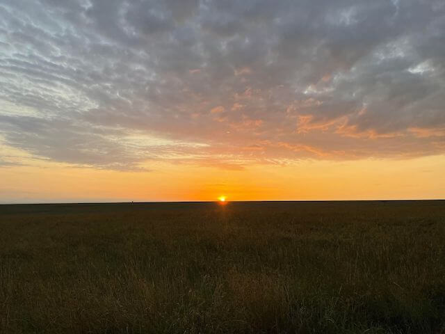
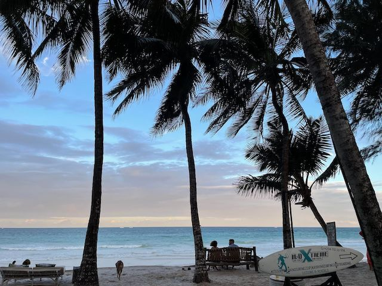

another city called Mombasa.

I also went to an elephant orphanage.

○○公園  
（場所の説明）  

rip-off  
ぼったくり  

## kaki
マジで！？  
写真とかあったら見せてくれない？  

動物とかサバンナとか。  

## Katie
いいよ。  
こんな感じの写真があるよ。  

  

  

  

  

  

## kaki
すげええー－！！！

野生のキリンとかシマウマとか像とか、初めて見たよ！  
動物園ぐらいでしか見た事ない！

## Katie

## kaki
ライオンも居るけど、危なくないの？　これ。  
襲ってきたら超怖いけど。  

## kaki
像の群れとか凄い。

温厚な性格とは聞くけど、触れたりする？  

キリンやシマウマも触れるか気になるけど。  

## Katie

## kaki
それにしても、広大な自然が凄いね。  

風景の写真とかも見てみたい。

## Katie
あるよ。こんな感じ。  

  

  

  

  

## kaki
すげええー－－！！！  
何かもう言葉が出てこない！  

素材サイトのフリー素材みたい！  

特に最後の夕日なんて凄すぎる！  
めちゃめちゃ神秘的！  

## Katie

## kaki

## Katie
あと、サバンナ以外だと、こんな感じの風景もあるよ。  

  

## kaki
ええええ！？　何これ？！　どこ？？  

めちゃくちゃ奇麗なビーチじゃん！

ケニア・・・というかアフリカって、全然ビーチのイメージとか無かったからびっくりしたよ！

## Katie

