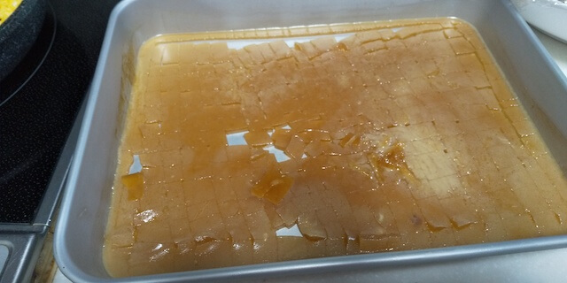

【食戟のソーマ】「化けるふりかけごはん」を作ってみたところ、どっちかというと鶏丼だった  
try-bakeru-furikake-rice  

(Anime)Food Wars! – I made "Morphing Furikake Rice". It was chicken bowl.  
try-morphing-furikake-rice  

__________________________________________________________________________________________

食戟のソーマのレシピ挑戦：第二弾。  
「化けるふりかけごはん」を試してみました。  
The series of cooking challenge of the recipe from "Food Wars!: Shokugeki no Soma": part 2.  
This time, I tried to recreate "Morphing furikake rice".  

コミックスのおまけコーナーにレシピと材料が書いてあったので、今回はそれを参考にしました。  
The author wrote a recipe and ingredients in the bonus corner of the comic.  
So I used that as a reference.  

## メイキング
## Cooking process
以下、コミックスに記載されていた材料の内訳です。  
These are ingredients written in comic book.  

>（2～3人分）  
>手羽先・・・７本  
>ごま油・・・大さじ１  
>
>たまご・・・4個  
>刻みネギ・・お好みで  
>
>砂糖・・・・大さじ１  
>塩・・・・・少々  
>
>おろししょうが・・・・小さじ１  
>かつおだし汁・・・・・700CC  
>酒・砂糖・みりん・・・各大さじ 1.5  
>薄口しょうゆ・・・・・50cc  

>(Serving for 2 to 3)  
>chicken wings ..... 7  
>sesame oil ........ 1 tablespoon  
>  
>eggs .... 4  
>chopped green onion .... as you like  
>  
>sugar ... 1 tablespoon  
>salt　.... a pinch  
>grated ginger .... 1 teaspoon  
>bonito broth .... 700cc  
>light soy sauce ... 50cc  

前回の[なんちゃってローストポーク](https://kaki-engine.com/try-nanchatte-roast-pork/)は準備が結構大変でしたが、今回は割とお手軽です。  
The last "Joke Roast Pork" I made was very tedious to prepare, but this is easy to prepare.  
  

手羽先を焼いている間、煮汁を準備します。  
While you grill chicken wings, prepare the bonito broth and add seasoning.  
  

焼きあがったら、手羽先を煮汁に投入。  
弱火にかけながら１時間ほど放置。  
Once they are done, throw the chicken wings into the bonito broth, and cook approximately one hour in low heat.  
  

煮込んだら手羽を取り出し、骨を抜いてほぐす。  
After one hour, put out the chicken wings, and remove the bones and shred it.  
煮汁はタッパーに入れて冷蔵庫に入れて固める。  
Then, you pour the bonito broth into container and put it in the refrigerator.
  

煮汁が固まったら、卵そぼろを作る。  
When the broth has hardened, make the scrambled egg.  
  

固まった煮汁（煮こごり）をサイコロ状に切ると、こんな感じです。  
When you cut the jellied broth into dices, it looks like this.  
  

ほぐした手羽と混ぜたところ  
Here is a mix of jelly with shredded chicken wings.  
  

作中では、卵そぼろに煮こごりが覆い隠されている感じだったので、それを再現するとこうなりました。  
In this anime(and Manga), jellied broth are covered with scrambled egg.  
Here is the reproducing.  
  

混ぜた具をごはんの上にかけると、こんな感じ。  
Here is the mixture on top of the rice.  
  

## 食べてみた感想
## Tasting report
かなり美味しい。  
Quite delicious!  

が、ふりかけごはんというよりは鶏丼です。（作る前から何となく予想はできたけど）  
However, it was a "chicken bowl", not "furikake rice". (I could predict that before I cook it.)

煮汁から取り出した手羽だけでも相当いけます。  
（煮汁から取り出した手羽を食べてるだけでも、かなり美味しいです。）  
Just the chicken wings taken out of the broth is quite tasty.  
手羽先をここまで味を染み込ませる料理を作る事は殆どなかったので、それだけでもいつもと違った風味を味わう事ができました。  
I've never made chicken wings that soaks up the flavor of broth so much, so I was able to enjoy a different flavor than from usual.  

煮こごりがごはんの熱で溶けて、ごはんに染み渡っていく様子は原作そのままです。  
The way the jellied broth melts by the heat of the rice and soaks into the rice is just like the original story.  

煮こごりが溶けていく過程で、めちゃくちゃごはんに味が浸透していき、深い味わいが出てきます。  
As the jellied broth melts, the flavor get absorbed by the rice, giving it a deep flavor.  

__________________________________________
## 分かった事
## What I found out

### ステンレス製のタッパーを使った方がいい
### Better use a stainless steel Tupperware.
他にも挑戦した方々のブログを見てみたのですが、「２時間経っても煮汁が固まらない！」といった記事もありました。  
I looked at the blogs of other people who tried it, and there was an article saying, "The broth doesn't harden even after 2 hours!"

今回の場合、ステンレス製のタッパーを使い、薄くのばしていたおかげか、１時間程度で固まってくれました。  
In this case, I used a stainless steel Tupperware and spread it thinly, so it hardened in about an hour.  

### 手羽の骨取りは念入りに
### The process of carefully removing the chicken wing bones
食べる時に邪魔になります。  
The bones of the wings are a distraction when eating.  

箸で取るだけでなく、ビニール手袋を使いつつ手で全部取り除いた方が良さそうです。  
It would be better to not only remove them with chopsticks, but to remove them all by hand while using plastic gloves.  

### 煮こごりを直接ごはんの上に乗せた方がいい
### It is better to put the jellied broth directly on top of the rice.
煮こごりをごはんの熱で溶かすために、それらの接触面積が大きくなるようにした方がいいです。  
In order to melt the jellied broth with the heat of the rice, it is better to make their contact area large.  

原作を忠実に再現すると、ごはんと一番接面積が大きくなるのは卵そぼろになります。  
If the original is faithfully reproduced, it is the scrambled egg that has the largest contact area with the rice.  

ごはんの上に、煮こごり → 手羽先 → 卵そぼろ　という順番で乗せていく方が美味しく食べられます。  
It is better to put jellied broth, chicken wings, and scrambled egg on top of the rice in this order.  
（それもうふりかけごはんちゃうやんけ、という話にはなりますが。）  
(I know, that's not furikake rice anymore...)  

### 煮こごりが固まるまでの間はどうすれば・・・？
### What should I do until the jellied broth hardens?
手羽ほぐしを作り、煮こごりが出来上がるまで、約１時間ほどかかります。  
It takes about 1 hour to make the chicken wings mash and to finish the jellied broth.  

その間に、せっかく作った手羽が冷めてしまうが、どうすれば・・・？  
In the meantime, the chicken wings I made will get cold, what should I do?  

２食、３食と作っていけば解決できるんだろうけど、そこまでする気にはなれないし。  
I guess I can solve it if I make 2 or 3 meals, but I don't feel like going that far.  

## 終わりに
## To sum up
家族にも食べてもらったところ、好評でした。  
I had my family try it and they loved it.  

機会があればまた。  
I will try again if I have the chance.  

という事で、お粗末。  
Then,  "Happy to serve!",
  

## おまけ
## Extra
英語版も書いてみました。  
I also wrote about it in English.  

「化けるふりかけごはん」の英訳は、漫画版の "Morphing furikake rice" を採用しています。
The English translation of "Bakeru Furikake Gohan" uses the manga version "Morphing furikake rice".

____________________
# 用語（多分）

手羽先  
chicken wings  

煮こごり  
jellied broth  

煮汁  
broth  

卵そぼろ  
scrambled egg  

bake - オーブンで焼く  
grill - フライパンで焼く  
stir - 炒める  

