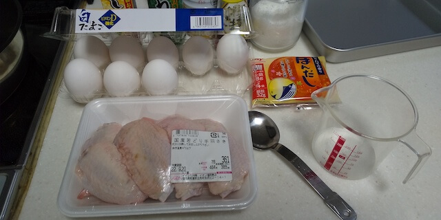
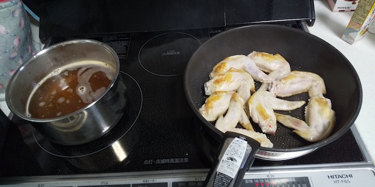
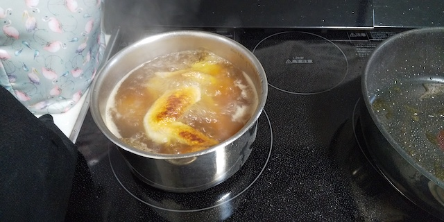
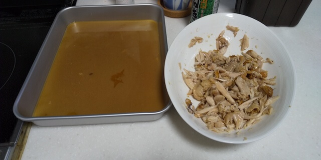
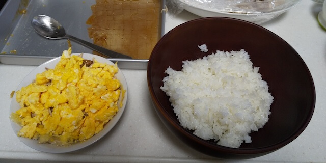
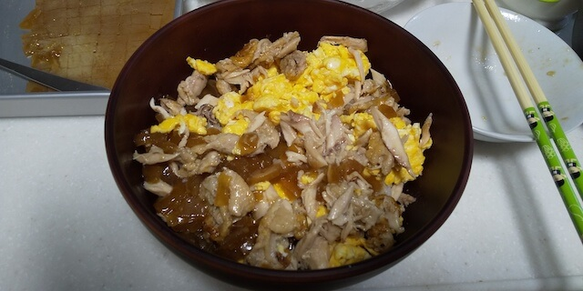
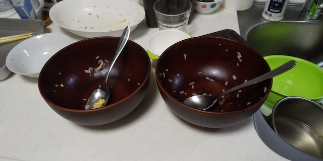
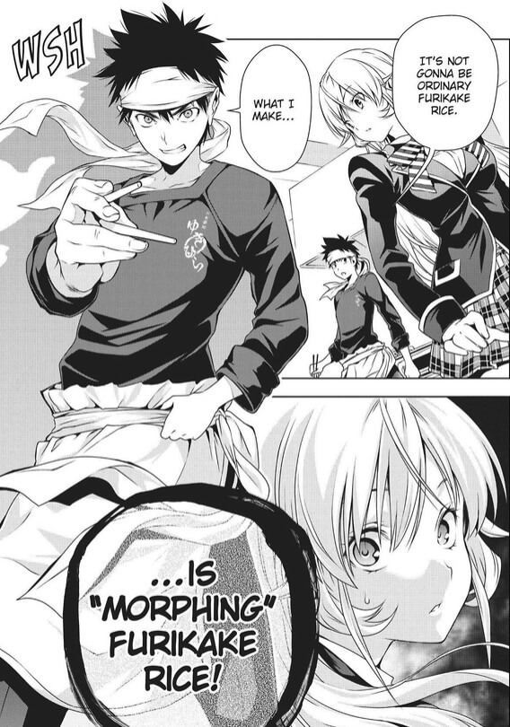

【食戟のソーマ】「化けるふりかけごはん」を作ってみたところ、どっちかというと鶏丼だった  
try-morphing-furikake-rice

__________________________________________________________________________________________

食戟のソーマのレシピ挑戦：第二弾。  
「化けるふりかけごはん」を試してみました。  

コミックスのおまけコーナーにレシピと材料が書いてあったので、今回はそれを参考にしました。  

## メイキング
以下、コミックスに記載されていた材料の内訳です。  

>（2～3人分）  
>手羽先・・・７本  
>ごま油・・・大さじ１  
>
>たまご・・・4個  
>刻みネギ・・お好みで  
>
>砂糖・・・・大さじ１  
>塩・・・・・少々  
>
>おろししょうが・・・・小さじ１  
>かつおだし汁・・・・・700CC  
>酒・砂糖・みりん・・・各大さじ 1.5  
>薄口しょうゆ・・・・・50cc  

前回の[なんちゃってローストポーク](https://kaki-engine.com/try-nanchatte-roast-pork/)は準備が結構大変でしたが、今回は割とお手軽です。

  

手羽先を焼いている間、煮汁を準備します。
  

焼きあがったら、手羽先を煮汁に投入。  
１時間ほど放置。  
  

煮込んだら手羽を取り出し、骨を抜いてほぐす。  
煮汁はタッパーに入れて冷蔵庫に入れて固める。  
  

煮汁が固まったら、卵そぼろを作る。  
  

固まった煮汁（煮こごり）をサイコロ状に切ると、こんな感じです。  
  

ほぐした手羽と混ぜたところ  
  

作中では、卵そぼろに煮こごりが覆い隠されている感じだったので、それを再現するとこうなりました。  
  

ご飯の上にかけて混ぜると、こんな感じ。
  

## 食べてみた感想
かなり美味しい。  
が、ふりかけごはんというよりは鶏丼です。（作る前から何となく予想はできたけど）

煮汁から取り出した手羽だけでも相当行けます。  
手羽先をここまで味を染み込ませる料理を作る事は殆どなかったので、それだけでもいつもと違った風味を味わう事ができました。  

煮こごりがごはんの熱で溶けて、ごはんに染み渡っていく様子は原作そのままです。  
煮こごりが溶けていく過程で、めちゃくちゃごはんに味が浸透していき、深い味わいが出てきます。

## 分かった事

### ステンレス製のタッパーを使った方がいい
他にも挑戦した方々のブログを見てみたのですが、「２時間経っても煮汁が固まらない！」といった記事もありました。  

今回の場合、ステンレス製のタッパーを使い、薄くのばしていたおかげか、１時間程度で固まってくれました。  

### 手羽の骨取りは念入りに
食べる時に気になります。  
箸で取るだけでなく、ビニール手袋を使いつつ手で全部取り除いた方が良さそうです。  

### 材料を分けずに、ごはんの上に乗せた方がいい
煮こごりをごはんの熱で溶かすために、それらの接触面積が大きくなるようにした方がいいです。

原作を忠実に再現すると、ごはんと一番接面積が大きくなるのは卵そろぼになります。

ごはんの上に、煮こごり → 手羽先 → 卵そぼろ　という順番で載せていく方が美味しく食べられます。
（それもうふりかけごはんちゃうやんけ、という話にはなりますが。）

### 煮こごりが固まるまでの間はどうすれば・・・？
手羽ほぐしを作り、煮こごりが出来上がるまで、約１時間ほどかかります。  

その間に、せっかく作った手羽が冷めてしまうが、どうすれば・・・？  
２食、３食と作っていけば解決できるんだろうけど、そこまでする気にはなれないし。

## 終わりに
家族にも食べてもらったところ、好評でした。

機会があればまた。

という事で、お粗末。
  

