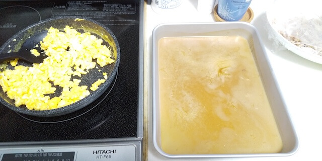

(Anime)Food Wars! – I made "Morphing Furikake Rice". It was chicken bowl.
try-morphing-furikake-rice

__________________________________________________________________________________________

The series of cooking challenge of the recipe from "Food Wars!: Shokugeki no Soma": part 2.
This time, I tried to recreate "Morphing furikake rice".

The author wrote a recipe and ingredients in the bonus corner of the comic.
So I used that as a reference.

## Cooking process
These are ingredients written in comic book.

>(Serving for 2 to 3)
>chicken wings ..... 7
>sesame oil ........ 1 tablespoon
>
>eggs .... 4
>chopped green onion .... as you like
>
>sugar ... 1 tablespoon
>salt　.... a pinch
>grated ginger .... 1 teaspoon
>bonito broth .... 700cc
>light soy sauce ... 50cc

The last "[Joke Roast Pork](https://kaki-en-talk.com/try-joke-roast-pork/)" I made was very tedious to prepare, but this is easy to prepare.

While you grill chicken wings, prepare the bonito broth and add seasoning.

Once they are done, throw the chicken wings into the bonito broth, and cook approximately one hour in low heat.

After one hour, put out the chicken wings, and remove the bones and shred it.
Then, you pour the bonito broth into container and put it in the refrigerator.

When the broth has hardened, make the scrambled egg.

When you cut the jellied broth into dices, it looks like this.

Here is a mix of jelly with shredded chicken wings.

In this anime(and Manga), jellied broth are covered with scrambled egg.
Here is the reproducing.

Here is the mixture on top of the rice.

## Tasting report
Quite delicious!

However, it was a "chicken bowl", not "furikake rice". (I could predict that before I cook it.)

Just the chicken wings taken out of the broth is quite tasty.

I've never made chicken wings that soaks up the flavor of broth so much, so I was able to enjoy a different flavor than from usual.

The way the jellied broth melts by the heat of the rice and soaks into the rice is just like the original story.

As the jellied broth melts, the flavor get absorbed by the rice, giving it a deep flavor.

## What I found out

### Better use a steel container.
I looked at the blogs of other people who tried to recreate it, and some of them said, "The broth doesn't harden even after 2 hours!"

In this case, I used a steel container and spread it thinly, so it hardened in about an hour.

### carefully remove the chicken wing bones
It is difficult to eat if there are chicken bones.

It would be better not to only remove them with chopsticks, but to remove them all using plastic gloves.

### It is better to put the jellied broth directly on top of the rice.
In order to melt the jellied broth with the heat of the rice, it is better to make their contact area larger.

If I tried to recreate exactly same as original, it is the scrambled egg that has the largest contact area with the rice.

It is better to put jellied broth, chicken wings, and scrambled egg on top of the rice in this order.
(I know, that's not furikake rice anymore...)

furukake...seaweed, sesame seeds, and other seasonings sprinkled over rice often sold in inexpensive packets.

### What should I do while I wait for jellied broth hardens?
It takes about 1 hour to make the shredded chicken wings and to finish the jellied broth.

In the meantime, the chicken wings I made will get cold, what should I do?

I guess I can solve it if I cook 2 or 3 more side dishes, but I don't feel like going that far.

## To sum up
I had my family try it and they loved it.

I will try again if I have a chance.

Then,"Happy to serve!"

## Extra
I also wrote about it in Japanese.

"Morphing furikake rice" is "Bakeru Furikake Gohan" in Japanese edition.

